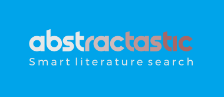

Ever wanted to get a quick background check of the hot-shot you were about to meet? Or you were wondering what's new in the house, or just wanted to dip your toes in a new field? How about hidden associations in a simple search that finds thousands of papers?

Abstractastic will do its best to help you. It can mine and meaningfully process abstracts from PubMed by borrowing the power of some pretty sweet feats of manking: the vast Medline database, capabilities of R, and AI text processing.

link to app: https://mulderst.shinyapps.io/Abstractastic/

Development plan:
- start up <-- current phase
- sell out
- cash in
- bro down
